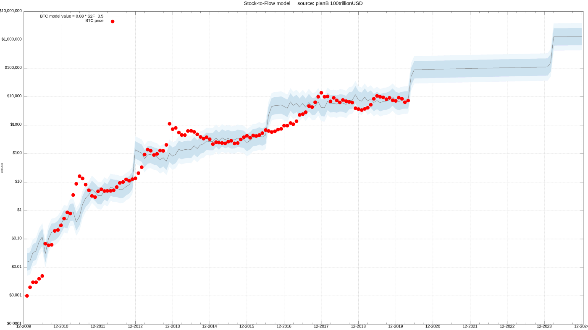
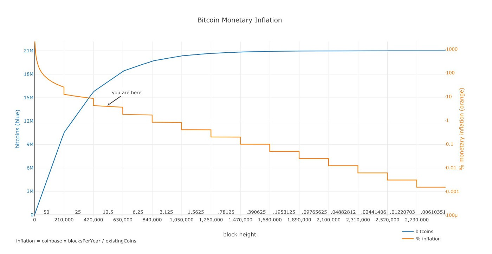

<<<<<<< HEAD
Heart Capital is a multi-strategy crypto asset Investment management firm that aims to partner with heart-centered High Net Worth Individuals and endowment funds seeking the benefits from exposure to cryptoassets.
=======

>>>>>>> 7054efe68ded9d0f9ddf530effdc33e8296f2a3e

The Market Research Jupyter notebook details the current opportunity.

<<<<<<< HEAD
Website Link: www.heartcap.io
=======
    Heart Capital, LLC was incorporated in January of 2018. HeartCap was founded by Trevor Orsinger(Lawyer), Charlie McKenna(Wealth Advisor, CPA), and Grant DePalma(Ex-Athlete, Engineer). The idea of the firm came from when the 3 founders shining light upon a lucky opportunity in time for wealth creation in the form of an emerging uncorrelated and antifragile asset class with an assymetric positive reward to risk profile resulting from a step function type innovation in finance. This opportunity combined with the team's experience and a culture that aims toward love yields the greatest probability of wealth creation for their partners. 

---

## 2. Business Activities

    Heart Capital, LLC is a multi-strategy CryptoAsset Investment management firm that partners with heart-centered High Net Worth Individuals and endowment funds seeking the benefits from exposure to cryptoassets. Heart Capital manages their cryptoassets. 
    
    Heart Capital offers the typical hedgefund model to it's partners. This includes a two percent management fee and 20 percent performance fee rebalanced quarterly with a 1 year lock up policy. 
    
    Heart Capital has partnered with Fidelity Digital as our institutional custodian providing a level of security that can be trusted by institutions and High Net Worth Individuals that is not available to retail investors. The Heart Capital management team has increased their probability of producing exceptional returns through their experience in the CryptoAsset Investment space giving them the required specific knowledge to properly play the volatility in the market. 
    
    Heart Capital believes in universal and timeless innovation and is committed to perpetually systemizing it's processes. We believe that blockchain technology's innovation from double entry accounting to triple entry accounting is extremely undervalued. The Crypto Revolution essentially represents the building of a Global Decentralized Computer. Simply put, computers must compute or process instructions and store data. A native medium to store and measure value is also needed in any ecosystem. The 3 projects that fulfill those functions are Bitcoin, Ethereum, and IPFS respectively. We believe that wealth in a digital world will be measured in from a Bitcoin(Digital Gold) Standard. The deflationary and finite nature of Bitcoin's monetary policy explains why it becomes more valuable over time. With a limited amount in existance in a rapidly growing digital world, every day that Bitcoin exists, it becomes more valuable. With a potential marketcap of 7.5 trillion USD (Gold's Marketcap), Bitcoin's price can be estimated at 357,000 USD/BTC. We believe that digital scaricity can be more valuable than physical scarcity represented by gold due to the infinite nature of the digital world where the Earth is finite. We believe that investing Bitcoin and the core elements of this new decentralized computing systme yields fantastic odds to generating generational wealth. HeartCapital aims to be the best performing crypto investment fund in the season after the third bitcoin halving. We define Bitcoin as a digitally scarce, cyptographically secured, decentralized asset. 
    
    HeartCap implements a proprierity asset allocation process that aims to minimize crypto investment risk and maximize alpha relative to BTC. 

    Heart Capital aims to build a fund that lasts by sticking to a 3 phase roadmap. Crawl. Walk. Run. 
     
        - Phase 1 could always be referred to as the crawling stage. Phase 1 was initiated in January of 2018 as a small friends and family fund where Heart Capital raised close to five hundred thousand dollars to invest in the emerging asset class. The friends and family fund will continue to be managed by HeartCap indefinitely.
        
        - Phase 2 could also be referred to as the walking stage. Phase 2 will be initiated on May 1, 2020 with the plan to upgrade operations and strategy and raise ten to fifty million in capital from High Net Worth Individuals and other investment vehicles such as endowment funds.
        
        - Phase 3 could also be referred to as the running stage. Phase 3 will be initiated as soon as the management team feels like the fund is ready to run. The running stage will include tokenization, quantitative trading, and tech upgrades. 

    There are 3 key advantages to investing in CryptoAssets. 
        1) Exposure to an uncorrelated asset: this reduces your overall risk in your portfolio
        2) Exposure to an asset class with a positive assymetric Reward to Risk Profile
        3) Exposure to white and black swans (Extremistan events in either direction)

    If you are an accredited investment vehicle like an endowment fund or High Net Worth Individual worth five million or more you are eligible to invest in Heart Capital's phase 2 fund. Please visit heartcap.io to apply. 
    
    If you are not an accredited investor Heart Capital is working hard to build a roboadvisor that can serve you in phase 3. In the meantime, start learning about the new generation of wealth!
--- 

## 3. Landscape

    The CryptoAsset Investment Management domain isn't definitely defined because of the just recent emergance of a new asset class referred to by some as "Digital Assets" and by others "CryptoAssets". According to Chris Burniske, a pioneer in the space, likes the term CryptoAsset because the word "Crypto", short for "Cryptography: secure value passing", refers to the cryptographic security that is unique  to the value proposition of cryptoassets. The second term refers to the Unit of Account portion of the value proposition. Polychain capital states, "The emergence of bitcoin and subsequent blockchain technologies has generated a new digital asset class in which scarcity is based on mathematical properties. Through cryptographic verification and game-theoretic equilibrium, blockchain-based digital assets can be created, issued, and transmitted using software."
    
    The domain seems to emerge from a variety of domains like digital wealth management, investment management, wealth management(74.3 trillion of global assets under management), proprietary trading, and Venture Capital. The clear way of defining this domain in the eyes of HeartCap are as following: 1)Invest in CryptoAssets 2)Benchmark Returns relative to Bitcoin's Performance 3)Raise outside capital. Ultimately, From billionaire fortune management to small-level personal financial advisors, the heart of wealth management is a value proposition: it's a promise of financial returns and security that exceeds whatever fees are associated with the service.

        
    Key Risks for CryptoAsset Investment Fund
        1. Regulation and Compliance
        2. Limited Partner Experience
        3. CyberSecurity
        4. Process Automation
        5. Exchange/Custody Risk
        6. Value Risk(Legitimacy of Space)
        7. Currency Conversion Risk
        8. Tax Risk
        9. Human Error (Fat Finger Risk)
       
        
    CryptoAsset Investment fund strategies can be classified as following:
        1. Fund of Funds: Investment strategy akin to MorganStanley's propriety fund allocation algorithm where funds are allocated to fund manageers based on their performance.
        2. Quantitative: Strategy relys on mathematical computations to identify trading opportunities in cryptoassets.
        3. Index: Strategy that invests in baskets of cryptoassets rebalanced periodically
        4. Tokenized: Strategy aimed to replace the illiquidity of venture capital by issuing crypto tokens instead of stock in new projects.
        5. Managed Futures: Strategy where managers actively trade futures contracts available through bitmex, binance, or dx/dy exchanges
        6. Mining: Strategy that looks to mine coins that start with a low hash rate and have a high probability of success relative to other coins.
        7. MultiStrategy: Strategy that diversifies investment based on a variety of strategies.
        8. Long/Short: Strategy that takes positions on both sides of market
        9. Long Only: Strategy that only takes long positions
        10. Macro: Strategy that invests in CryptoAssets as a bigger play in their overall global market strategy. 
        
    Competitive Funds
        1) Ikigai Asset Management is a long/short multistrat hedge fund investing in crypto assets. they seek to generate superior risk-adjusted returns through the execution of venture stage pre-ICO investments and both systematic and fundamental liquid hedge fund strategies.
        2) Polychain Capital is an organization that helps people take better control of their blockchain investment, Polychain Capital manages a hedge fund which invests in a diversified portfolio of blockchain tokens.
        3) a16z crypto is a 350M venture fund that will invest in crypto companies and protocols. Our fund is designed to include the best features of traditional venture capital, updated to the modern crypto world: We are long-term, patient investors. ... We plan to invest consistently over time, regardless of market conditions.
        4) DARMA Capital is an investment firm exclusively focused on digital assets. DARMA Capital provides investors professionally risk managed exposure to a specific set of blockchain assets that meet our high standards for return potential, liquidity, regulatory compliance and numerous other qualification requirements.
        5) MetaStable Capital, a stealthy startup hedge fund based in San Francisco that invests only in cryptocurrencies such as Bitcoin and Ethereum.

    
    More than half of the 75 trillion dollar AUM in the wealth management industry belong to institutional investors like banks and funds. The rest belong to individuals or smaller organizations. There is a shift wealth happening in the world today. Wealth is being passed down from older generations to their heirs with the baby boomers soon to be gone. There is also a rise in wealth created by High Performing athletes and entertainers, and women are also due for a rise in wealth. This new money requires a fresh look on how it will be invested.
    
    "New money Millennials will change wealth management because they are often more comfortable with digital technology than human wealth managers. One key difference between Millennials and older generations; is that Millennials prefer handling financial transactions themselves with digital solutions.Many Millennials will drop wealth managers that do not offer fast service and digital capabilities. One missed response could prompt a Millennial to change wealth managers, for example. McKinsey estimates that by 2030, that 80 percent of clients new to wealth management will want to access advice in a Netflix-style-model-that is, data-driven, personalized, continuous, and potentially, by subscription."  - McKinsey
    

    The major technology trends in the wealth management and investment management domains are RoboAdvisors in form of chatbots, Debiasing AI Techniques, Reduce Compliance Costs, AR/VR/Hologram, Adoption of Open APIs, Streamlining client onboarding, CRM, CIM, Automated Reporting, and tokenization of funds.
    
    CryptoAsset derivitaves like futures, options, and etfs are currently being built. 
    
    In 1993, the U.S. congress cut funding to the SuperColider. This lead to a massive cut in the market for high performing physicists and mathematicians. These physicists and mathematicians began to model the financial markets to generate money. This event can be inferred to be the catalyst of quantitative finance. 

    Bitcoin Stock to flow model predicts that Bitcoin's price will be valued at 55 thousand usd/btc after the Bitcoin halving in May 2020. After the 2012 halving, Bitcoin's Stock to Flow model predicted a value increase to 150 usd/btc and Bitcoin actually increased in value from 11.2 usd/btc to 1,112 usd/btc and back down to 184 usd/btc. After the 2016 halving, Bitcoin's Stock to Flow model predicted a value increase to roughly 7,000 btc/usd and Bitcoin actually increased from 400 usd/btc to 19,500 usd/btc and Bitcoin's alt coin relatives increased 13,400% relative to usd. 
    
    >2008: 0 --> 27.5 --> 1.98 usd/btc, infinite increase, 92.7% drawdown
    >2012: 11 --> 1,111 --> 411 usd/btc, 10,000% increase, 63% drawdown
    >2016: 400 --> 19,500 --> 3100 usd/btc, 4,775% increase, 84% drawdown
    >2020: ???

stock = size_of_reserves   
flow = yearly_production_of_supply    

$ supplygrowthrate = flow / stock $  
$ SF = 1 / supplygrowthrate = stock/flow  $  
    

    "Supply of bitcoin is fixed. New bitcoins are created in every new block. Blocks are created every 10 minutes (on average), when a miner finds the hash that satisfies the PoW required for a valid block. The first transaction in each block, called the coinbase, contains the block reward for the miner that found the block. The block reward consists of the fees that people pay for transactions in that block and the newly created coins (called subsidy). The subsidy started at 50 bitcoins, and is halved every 210,000 blocks (about 4 years). That's why 'halvings' are very important for bitcoins money supply and SF. Halvings also cause the supply growth rate (in bitcoin context usually called 'monetary inflation') to be stepped and not smooth." -@TrillionDollarUSD

    This brings up a point of emphasis that is obvious once you see it, but easy to look past. The monetary policy of Bitcoin is fundamentally different than the monetary policy of the legacy system. We currently live in a system that can print money as the centralized authority sees fit(Inflationary), where as Bitcoin is scarce and robust in nature due to the fixed changes to the flow of supply validated by everybody playing the game. There is no risk for hyperinflation this way. This gives insight into why cryptoassets are truly uncorrelated. 
    
---

### 4. Results
    
    The core performance metrics that cryptoasset investment funds aim to win are:
        1) Alpha relative to [BTC, USD]
        2) CryptoAsset Accumulation Rate 
        3) Assets Under Management 
    
    ALthough the results of the crawling phase were in the low quartile of funds that still exist, the majority of funds who started in 2018 no longer exist. Phase 1 has effectively served as a sandbox for the founders to learn lessons in space.
    
    According to the PWC Crypto Hedge Fund Report, quantitative strategies significantly outperform all other strategies in drawdown seasons.
    

### 5. Recommendations
    The following solutions are reccommended for Heart Capital to implement during phase 3. 

    1. Build and Implement RoboAdvisor that mimics core fund strategy 
    2. Build and Implement Quantitative approach to cryptoasset allocation
    3. Tokenize Fund
    4. Automate Processes with AI Powered pipelines
    
    Offering a roboadvisor service will allow new money investors not protected by accredited investment invest in our stragies. Offering a quantitative approach will increase return potential in drawdown seasons. Tokenizing the Fund will increase liquidity and security. Automating processes will improve loyalty and partner experiences while decreasing the amount of time spent on tasks that can be automated. These services utilize AI, Blockchain, algorithmic trading, API's, and cloud computing.   
 

### 6. Addendum

News, Research, Reports, and support     
[Andreessen Horowitz Targets 450mil Fund: Coindesk](https://www.coindesk.com/vc-firm-andreessen-horowitz-targets-450m-for-second-crypto-fund-report)  
[2019 Crypto Fund Report: PWC](https://www.pwc.com/gx/en/financial-services/fintech/assets/pwc-elwood-2019-annual-crypto-hedge-fund-report.pdf)  
[Crypto Asset Management: Investopedia](https://www.investopedia.com/tech/why-crypto-asset-management-next-big-thing/)  
[Endowment Interest](https://cointelegraph.com/news/94-of-surveyed-endowment-funds-are-allocating-to-crypto-investments-study)  
[Michigan Endowment Invests in Crypto](https://www.newsbtc.com/2019/02/22/another-university-endowment-invests-in-crypto-fund-2019-is-the-year-of-institutions/)
[bitcoin halving speculation](https://strixleviathan.com/blog/2020/4/1/bitcoin-halving-speculation)
[Corona x Global Economy x BTC](https://strixleviathan.com/blog/2020/3/12/a-tsunami-is-never-just-a-wave)
[diversification in Crypto](https://strixleviathan.com/blog/2020/3/17/the-only-free-lunch)  
[10x: Case of Crypto Hedge Funds](https://medium.com/@tokenomy/the-case-of-cryptocurrency-hedge-funds-228a5cc18e12)
[Top 100 by AUM, Age, firm size, crypto only investments, and reputation score](https://cryptofundresearch.com/top-100-crypto-hedge-funds/#close)  
[70 crypto hedge funds close](https://www.theblockcrypto.com/linked/49296/almost-70-crypto-hedge-funds-have-closed-this-year-as-institutional-investors-shy-away)  
[Quant Strategy in Crypto](https://www.youtube.com/watch?t=6s&v=6uqHV-Kuzo0)  
[Modeling Bitcoin w/Flow rate](https://medium.com/@100trillionUSD/modeling-bitcoins-value-with-scarcity-91fa0fc03e25)  
[Why CryptoAssets](https://medium.com/@cburniske/why-i-like-the-term-cryptoassets-ab6b76e1ee33) 
[History of Cryptography](https://cs.stanford.edu/people/eroberts/courses/soco/projects/public-key-cryptography/history.html)  
[Accredited Investor](https://www.investopedia.com/articles/investing/092815/how-become-accredited-investor.asp) 
[Crypto Money Flow](https://steemit.com/mgsc/@archana25/money-flow-in-crypto)
[How Big is Wealth Management Industry](https://www.investopedia.com/articles/professionals/111115/how-big-wealth-management-and-financial-advisor-industry.asp)  
[Best Wealth Management Firms](https://www.investopedia.com/articles/investing/061314/best-best-wealth-management-firms.asp) 
[Trends in Wealth Management](https://www.finextra.com/blogposting/18264/top-3-trends-that-will-influence-wealth-management-in-2020)   
[McKinsey on Wealth Management](https://www.forbes.com/sites/carriemccabe/2020/02/20/mckinsey-on-wealth-management--the-netflixing-of-advice/#51ddcc5d5027)  
[HedgeFund Principles](https://www.grin.com/document/138912)  
[CryptoAsset Benchmarking](https://www.researchgate.net/profile/Gina_Pieters/publication/330273280_2nd_Global_Cryptoasset_Benchmarking_Study/links/5de837d492851c8364628da1/2nd-Global-Cryptoasset-Benchmarking-Study.pdf)  
[Prop Trading](https://www.investopedia.com/terms/p/proprietarytrading.asp)
[Top WM Firms](https://www.thebalancecareers.com/top-wealth-management-firms-1287460)  
[2020 WM Challenges](https://www.finextra.com/blogposting/15660/wealth-management-challenges-in-2020-client-retention-in-the-digital-age)  
[Future of Fintech in WM Industry](https://wealthmanagement.bnpparibas/en/expert-voices/fintech-trends-in-wealth-management.html)  
[Top Ten ML in Finance Apps](https://algorithmxlab.com/blog/applications-machine-learning-finance/)  
[Wealth Management Software](https://www.prnewswire.com/news-releases/wealth-management-software-market-size-worth-5-80-billion-by-2025-grand-view-research-inc-300816288.html)  
[Morgan Stanley RoboAdvisor](https://www.morganstanley.com/what-we-do/wealth-management/access-investing/my-goals?cid=ppc-71700000045096467:700000001822699:58700004651057429:p39234095309&gclid=Cj0KCQjwhZr1BRCLARIsALjRVQMb7KvvcqVYkaVdip47JNPm84g4HmV-TtKAy6-3BEXA-ePUAhz_MsAaAkUbEALw_wcB&gclsrc=aw.ds)  
[Top 10 Robo-Advisors of 2020](https://www.consumersadvocate.org/robo-advisors/a/best-robo-advisors?pd=true&keyword=robo%20advisor&gca_campaignid=1677193901&gca_adgroupid=73663339588&gca_matchtype=p&gca_network=g&gca_device=c&gca_adposition=&gca_loc_interest_ms=&gca_loc_physical_ms=9021727&gclid=Cj0KCQjwhZr1BRCLARIsALjRVQMsAN8tWZ3sMP1bmt3HyE5a4y53kAVINNzHrlKD3MB3kchWfbgG8C8aAqbVEALw_wcB)  
[AI in 2020](https://www.youtube.com/watch?v=eN9Lb3vXsAw)  
[Tokenization](https://www2.deloitte.com/content/dam/Deloitte/lu/Documents/financial-services/lu-tokenization-of-assets-disrupting-financial-industry.pdf)  

CryptoAsset Institutional Exchange    
[Fidelity Digital](https://www.fidelitydigitalassets.com/overview)  

CryptoAsset Retail Exchanges    
[Exchange: Coinbase](https://www.coinbase.com/)  
[Exchange: Binance](https://www.binance.com/en)
[Exchange: Kraken](https://www.kraken.com/)  
[dydx: perpetual contracts](https://dydx.exchange/perpetual/)  

Major Research and Development Labs    
[Protocol Labs](https://protocol.ai/)  
[Binance Labs](https://bitcoin.org/bitcoin.pdf)  

Crypto Lending Platforms    
[Compound](https://compound.finance/)
[BlockFi](https://blockfi.com/)

Bitcoin Data Viz    
[bitaps: transactions](https://btc.bitaps.com/)  
[bitcoin average: Global Price Index](https://bitcoinaverage.com/en/bitcoin-price/btc-to-usd)  
[blockcyper: Blocks](https://bitcoinaverage.com/en/bitcoin-price/btc-to-usd)    
[TradeBlock: Markets, Bitcoin, Ethereum](https://tradeblock.com/bitcoin/historical/1d-f-txval_per_tot-01071-blksize_per_avg-01071)  
[Bitnodes: User Agents](https://bitnodes.io/nodes/live-map/?source=post_page---------------------------)  
[Btconometrics: Bitcoin Quantitative Analysis](https://btconometrics.com/#)  
[CoinMarketCap](https://coinmarketcap.com/)  

Core Projects    
[Bitcoin: Website](https://bitcoin.org/en/)  
[Bitcoin: Whitepaper](https://bitcoin.org/bitcoin.pdf)  
[Ethereum: Studio](https://studio.ethereum.org/)  
[Ethereum: Website](https://ethereum.org/)  
[Filecoin: Website](https://filecoin.io/)   
[Filecoin: Whitepaper](https://filecoin.io/filecoin.pdf)    

Mining Pools    
[btc.com](https://btc.com/)
[f2pool.com](https://www.f2pool.com/)
[AntPool](https://www.antpool.com/)
[poolin](https://www.poolin.com/)
[OKExPool](https://www.okex.com/pool)  
[ViaBTC](https://www.viabtc.com/?_ga=2.221191384.155853144.1587482338-1208547145.1587482338)  

Learn Bitcoin    
[Bitcoin Wiki](https://en.bitcoin.it/wiki/Main_Page)  
[Bitcoin Knowledge Podcast](https://www.bitcoin.kn/)   
[We Use Coins: Individuals, Storage, Merchants, Exchanges](https://www.weusecoins.com/)    
[Bitcoin Mining](https://www.bitcoinmining.com/)    
[IamSitoshi](http://www.iamsatoshi.com/category/video-archive/)

Wealth Funds    
[QuantFund: Strix Leviathan](https://strixleviathan.com/#new-page-section)
[Multi-Strategy Fund: Polychain Capital](https://polychain.capital/)  
[Miller Value Partners](https://millervalue.com/)  
[Long/Short Fund: Multicoin Capital](https://multicoin.capital/)  
[Index Fund: Grayscale](https://grayscale.co/?gclid=CjwKCAjwnIr1BRAWEiwA6GpwNRlxKKhM2fXYHhudSoylUWUCoftgMYsVJ1hjEHzsQpUayOxzB2lzzBoCqU8QAvD_BwE)  
[Macro Fund: Passport Capital](passportcapital.com)  
[Index Fund: Galaxy Fund Management](CjwKCAjwnIr1BRAWEiwA6GpwNdo53Yswm7nXxO1cJEo28TPBv3jkJNJgxD0A5V83cSCRyyejFMxhVxoC)  
[Long/Short Fund: Ikigai Asset Management](https://www.ikigai.fund/)  
[Darma Capital](darma.capital)  
[MetaStable](https://metastablecapital.com/index.html)
[Coin Shares](https://coinshares.com/)  
[Bluesky Capital Managment](https://www.blueskycapitalmanagement.com/systematic-crypto/)  
[Wealth Management: Morgan Stanley](https://www.morganstanley.com/what-we-do/wealth-management)
[Wealth Management: JPMorgan](https://am.jpmorgan.com/asset-management/gim/welcome)
[Institutional Asset Management: JPMorgan](https://am.jpmorgan.com/us/en/asset-management/institutional/)  
[Wealth Management: Goldman](https://www.goldmansachs.com/what-we-do/consumer-and-investment-management/private-wealth-management/)  

[Bitcoin Wallets](https://bitcoin.org/en/choose-your-wallet) 
[Github Projects](http://www.bitcoinprojects.net/)  
[Buy Bitcoin Worldwide](https://www.buybitcoinworldwide.com/)  

Bitcoin Culture     
[Evolution of Bitcoin](https://www.youtube.com/watch?v=HUpGHOLkoXs)  
[Magic Money](https://www.youtube.com/watch?v=PVo5wCSnmSs)  
[Bitcoin: Beyond the Bubble](https://www.youtube.com/watch?v=LszOt51OjXU)  
[The Bitcoin Pheomenon](https://www.youtube.com/watch?v=6pWblf8COH4)  
[Ulterior States]

CryptoWealth Reading      
[Mastering Bitcoin](https://github.com/bitcoinbook/bitcoinbook)
[Reading List](https://github.com/jashmenn/bitcoin-reading-list)  
[Bitcoin Standard](https://www.amazon.com/Bitcoin-Standard-Decentralized-Alternative-Central/dp/1119473861)  
[Digital Gold](https://www.amazon.com/s?k=digital+gold&i=stripbooks&crid=UYMYEGA2LTWK&sprefix=digital+gold%2Cstripbooks%2C219&ref=nb_sb_ss_i_1_12)  
[Programming Bitcoin](https://www.amazon.com/Programming-Bitcoin-Learn-Program-Scratch-ebook/dp/B07NM32WGH/ref=sr_1_1?crid=2KFNUDGWWAU9Y&dchild=1&keywords=programming+bitcoin&qid=1588117310&s=books&sprefix=programming+bitcoin%2Cstripbooks%2C173&sr=1-1)  
[CryptoAssets](https://www.amazon.com/Cryptoassets-Innovative-Investors-Bitcoin-Beyond/dp/1260026671) 
[way of the turtle](https://www.amazon.com/Way-Turtle-Methods-Ordinary-Legendary-ebook/dp/B00B22SBS8/ref=sr_1_1?crid=15LH7QTPD0WK1&dchild=1&keywords=way+of+the+turtle&qid=1588117333&s=books&sprefix=way+of+the+tur%2Cstripbooks%2C183&sr=1-1)   
[Principles](https://www.amazon.com/Principles-Life-Work-Ray-Dalio/dp/1508243247/ref=sr_1_1_sspa?crid=32MXXB0RHVMT1&dchild=1&keywords=principles+ray+dalio&qid=1588117363&s=books&sprefix=principle%2Cstripbooks%2C210&sr=1-1-spons&psc=1&spLa=ZW5jcnlwdGVkUXVhbGlmaWVyPUExV1BDWVIzQ1BWVDY0JmVuY3J5cHRlZElkPUEwNDgyNDg5MTk5M1M1TExXUjRUNCZlbmNyeXB0ZWRBZElkPUEwMTcyMjY1MUtFNTlST1pJRTNUSCZ3aWRnZXROYW1lPXNwX2F0ZiZhY3Rpb249Y2xpY2tSZWRpcmVjdCZkb05vdExvZ0NsaWNrPXRydWU=)    
[Python for Finance](https://www.amazon.com/Python-Finance-Mastering-Data-Driven-ebook/dp/B07L8NMW2P/ref=sr_1_3?dchild=1&keywords=python+for+finance&qid=1588117387&s=books&sr=1-3)  
[Incerto Series](https://www.amazon.com/Incerto-Deluxe-Randomness-Procrustes-Antifragile/dp/198481981X/ref=sr_1_2?dchild=1&keywords=incerto+series&qid=1588117416&s=books&sr=1-2)
[Dynamic Hedging](https://www.amazon.com/Incerto-Deluxe-Randomness-Procrustes-Antifragile/dp/198481981X/ref=sr_1_2?dchild=1&keywords=incerto+series&qid=1588117416&s=books&sr=1-2)
[Options Pricing and Volatility](https://www.amazon.com/Option-Volatility-Pricing-Strategies-Techniques-ebook/dp/B00O2A7HMS/ref=sr_1_1?dchild=1&keywords=options+pricing+and+volatility&qid=1588117470&s=books&sr=1-1)  

Binance Research (These are really well done)   
[Portfolio Optimization w/BnB](https://research.binance.com/analysis/bnb-portfolio-optimization)  
[MultiAsset Portfolios: CryptoAsset Diversification Benefits](https://research.binance.com/analysis/bitcoin-diversification-benefits)  
[Categorizing CryptoAssets: Return-Driven Cluster Analysis](https://research.binance.com/analysis/cluster-analysis)  
[CryptoAsset Cycles](https://research.binance.com/analysis/cryptoasset-cycles)  
[Arb and Carry Trades](https://research.binance.com/analysis/defi-arbitrage-strategies)  
[Bitcoin Mining Allocation Strategy](https://research.binance.com/analysis/bitcoin-mining-allocation)   
[Institutional Money FLow 1](https://research.binance.com/analysis/institutional-insights-q2-2019)  
[Institutional Money Flow 2](https://research.binance.com/analysis/institutional-insights-2nd-edition)  
[Token Economies: Utility, Security, and Proprietary Tokens](https://research.binance.com/analysis/tokenization)  
[Evolution of Stablecoins](https://research.binance.com/analysis/stablecoins-evolution)  
[Ethereum (ETH)](https://research.binance.com/projects/ethereum)
[EOS (EOS)](https://research.binance.com/projects/eos)
[Ethereum Classic (ETC)](https://research.binance.com/projects/ethereum-classic)
[Cardano (ADA)](https://research.binance.com/projects/cardano)
[Monero (XMR)](https://research.binance.com/projects/monero)  
[Bitcoin Cash (BCH)](https://research.binance.com/projects/bitcoin-cash)
[Tezos (XTZ)](https://research.binance.com/projects/tezos)  

Binance Services   
[Charity](https://www.binance.charity/)  
[Exchange](https://www.binance.com/en)  
[Information Platform](https://info.binance.com/)  
[Crypto Academy](https://www.binance.vision/)  
[Project Incubator](https://labs.binance.com/)  
[Token Launch Platform](https://launchpad.binance.com/)  
[Research](https://research.binance.com/)  
[Wallet](https://trustwallet.com/)  

Binance Academy
[Blockchain Use Cases](https://www.binance.vision/blockchain/blockchain-use-cases)  
[Wyckoff Method](https://www.binance.vision/economics/the-wyckoff-method-explained)  
[The Psychology of Market Cycles](https://www.binance.vision/economics/the-psychology-of-market-cycles)  
[Smart Contracts](https://www.binance.vision/blockchain/what-are-smart-contracts)
[Remittance](https://www.binance.vision/blockchain/blockchain-use-cases-remittance)  
[Binance Margin Trading](https://www.binance.vision/tutorials/binance-margin-trading-guide)  
[Options Contracts](https://www.binance.vision/economics/what-are-options-contracts)
[Margin Trading](https://www.binance.vision/economics/what-is-margin-trading)  
[Social Engineering](https://www.binance.vision/security/what-is-social-engineering)
[Blockchain in HealthCare](https://www.binance.vision/blockchain/blockchain-use-cases-healthcare)  
[Quantitative Easing](https://www.binance.vision/economics/what-is-quantitative-easing)  
[Fractional Reserve](https://www.binance.vision/economics/what-is-fractional-reserve)  
[Game Theory and Crypto](https://www.binance.vision/economics/game-theory-and-cryptocurrencies)  
[Why Public Wifi is Insecure](https://www.binance.vision/security/why-public-wifi-is-insecure)
[History of Cryptography](https://www.binance.vision/security/history-of-cryptography)  
[2008 Financial Crisis](https://www.binance.vision/economics/the-2008-financial-crisis-explained)  
[Fiat Currency](https://www.binance.vision/economics/what-is-fiat-currency)  
[What is Ripple](https://www.binance.vision/economics/what-is-ripple)  
[Pros and COns of Blockchain](https://www.binance.vision/economics/what-is-ripple)  
[What is Coin Burn](https://www.binance.vision/economics/what-is-ripple)  
[Trust Wallet](https://www.binance.vision/security/what-is-trust-wallet)  
[Byzantine Fault Tolerance](https://www.binance.vision/blockchain/byzantine-fault-tolerance-explained)  
[Liquidity Explained](https://www.binance.vision/economics/liquidity-explained)  
[Quantum Computers and CryptoCurrencies](https://www.binance.vision/blockchain/quantum-computers-and-cryptocurrencies)  
[AI x Blockchain](https://www.binance.vision/blockchain/blockchain-and-artificial-intelligence-the-future-of-technology-explained)  
[Blockchain Scalability](https://www.binance.vision/blockchain/blockchain-scalability-sidechains-and-payment-channels)  
[Leveraged Tokens](https://www.binance.vision/economics/a-beginners-guide-to-leveraged-tokens)  
[Fibonacci Retracement](https://www.binance.vision/economics/a-guide-to-mastering-fibonacci-retracement)  
[Crypto Lending](https://www.binance.vision/tutorials/the-ultimate-guide-to-earning-crypto-with-binance-lending)  
[Perpetual Futures Contracts](https://www.binance.vision/economics/what-are-perpetual-futures-contracts)
[Trading Futures](https://www.binance.vision/tutorials/the-ultimate-guide-to-trading-on-binance-futures)  
[Forward and Future Contracts](https://www.binance.vision/economics/what-are-forward-and-futures-contracts)  
[Asset Allocation and Diversification](https://www.binance.vision/economics/asset-allocation-and-diversification-explained)  
[Guide To Blockchain Tech](https://www.binance.vision/blockchain/what-is-blockchain-technology-a-comprehensive-guide-for-beginners)  
[Stock To Flow Model](https://www.binance.vision/economics/bitcoin-and-the-stock-to-flow-model)  
[Intro to Ethereum](https://www.binance.vision/blockchain/what-is-ethereum)  
[Bitcoin as Store of Value](https://www.binance.vision/economics/is-bitcoin-a-store-of-value) 
[Intro to Bitcoin](https://www.binance.vision/blockchain/what-is-bitcoin)  
[Decentralized Autonmous Organizations](https://www.binance.vision/blockchain/decentralized-autonomous-organizations-daos-explained)  
[Beginner's Guide](https://www.binance.vision/economics/a-beginners-guide-to-security-tokens)   
[Learn AI](https://www.youtube.com/channel/UCWN3xxRkmTPmbKwht9FuE5A/videos)  
[MIT Math x Finance Course](https://ocw.mit.edu/courses/mathematics/18-s096-topics-in-mathematics-with-applications-in-finance-fall-2013/video-lectures/lecture-20-option-price-and-probability-duality/)  
>>>>>>> 7054efe68ded9d0f9ddf530effdc33e8296f2a3e
